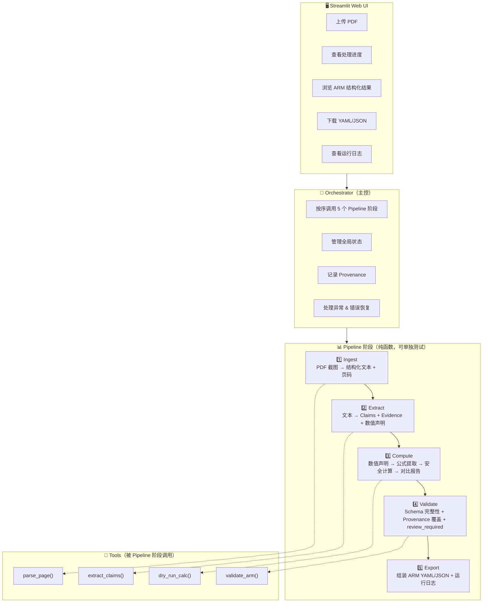
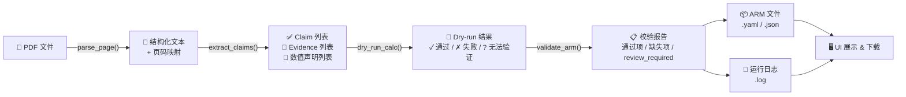
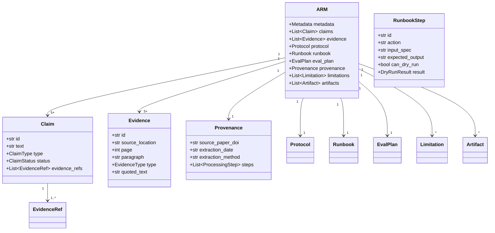

# ECS Paper-to-ARM Agent — 架构设计 v1

## 1. 整体分层架构

## 2. 数据流向（Pipeline 阶段细节）

## 3. ARM 结构（Pydantic Schema）

## 4. 核心设计决策

| # | 决策 | 理由 |
|---|------|------|
| 1 | 每阶段输入输出都是 **Pydantic 对象** | 接口清晰，阶段可独立单元测试 |
| 2 | **Provenance 贯穿全流程** | 每个字段记录来源页码、段落、提取方式 |
| 3 | Pipeline **确定性优先** | 同一论文两次运行结构一致；LLM 调用 temperature=0 |
| 4 | Dry-run 在**安全沙箱**中运行 | 只允许 `math` + 基础统计函数，禁止文件/网络/系统调用 |
| 5 | 提取方式三分类 | `exact_quote`（原文引用）/ `llm_inferred`（模型推断）/ `review_required`（需人工） |
| 6 | 先 Pipeline 后 Agentic | 线性流程优先确保七日交付，逻辑验证后加入 self-check 循环 |

## 5. 技术选型

| 组件 | 选择 | 原因 |
|------|------|------|
| Agent 框架 | OpenAI Agents SDK | 考核推荐，Pydantic 原生集成，tracing 内置 |
| LLM | DeepSeek V4 | 考核提供 API（100 元额度） |
| 结构化输出 | Pydantic BaseModel | SDK 原生支持 `output_type` |
| Web UI | Streamlit | 开发快，单页面上传+展示足够 |
| PDF 处理 | PyMuPDF (fitz) 文本提取 + 页码标注 | DeepSeek V4 不支持视觉；PyMuPDF 更快、更确定、零 API 成本 |
| Dry-run 沙箱 | 受限 `exec()` + 白名单内置函数 | 简单可控，无需 Docker |
| 导出格式 | YAML（人读）+ JSON（机器读） | 考核要求可导出 |
| 测试 | pytest + fixture 论文文本 | 确定性 pipeline 阶段独立可测 |
